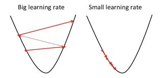
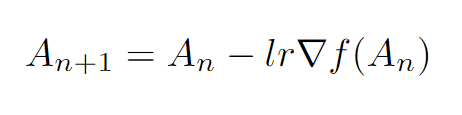
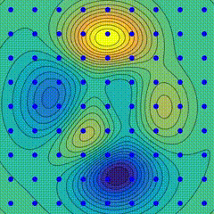
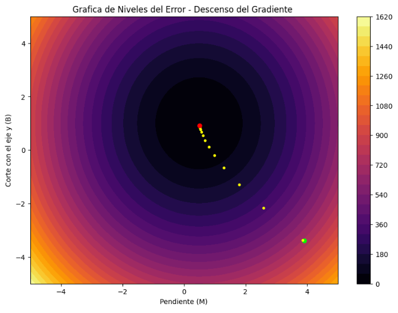
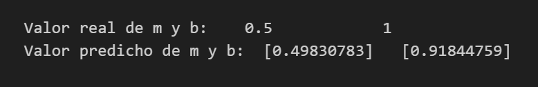

# Descenso del Gradiente
Es un algoritmo de optimización utilizado para encontrar el mínimo de una función, especialmente en el contexto del aprendizaje automático y la optimización numérica. El objetivo del descenso del gradiente es ajustar los parámetros de un modelo de manera iterativa para minimizar una función de pérdida.

Su nombre proviene del hecho de que estamos "descendiendo" por la superficie de la función de pérdida siguiendo la dirección más pronunciada de descenso, que es el gradiente. Es un algoritmo fundamental en el campo del aprendizaje automático y se utiliza en una variedad de contextos, desde la regresión lineal hasta el entrenamiento de redes neuronales profundas.

# Pasos a Seguir en la Construcción del Algoritmo

**Inicialización de parámetros:** Comenzamos con un conjunto inicial de parámetros para nuestro modelo. Estos parámetros podrían ser los pesos en una red neuronal, por ejemplo.

**Cálculo del gradiente:** Calculamos el gradiente de la función de pérdida con respecto a los parámetros actuales. El gradiente indica la dirección y la magnitud del cambio más pronunciado en la función de pérdida. Queremos mover nuestros parámetros en la dirección opuesta al gradiente para minimizar la función de pérdida.

**Actualización de parámetros:** Ajustamos los parámetros en la dirección opuesta al gradiente multiplicado por una tasa de aprendizaje. La tasa de aprendizaje controla qué tan grande es el paso que damos en cada iteración. Una tasa de aprendizaje más grande puede llevar a convergencia más rápida, pero también puede hacer que el algoritmo sea inestable o que se salte mínimos locales. Por otro lado, una tasa de aprendizaje más pequeña puede hacer que la convergencia sea más lenta pero más precisa.

<table>
  <tr>
    <td></td>
    <td></td>
  </tr>
</table>

**Repetición:** Repetimos hasta que se satisfaga algún criterio de parada, como un número máximo de iteraciones alcanzado, una tolerancia para la convergencia, o cualquier otro criterio definido por el usuario.

**Convergencia:** Esperamos que con suficientes iteraciones y una elección adecuada de la tasa de aprendizaje, el algoritmo converja a un mínimo local o global de la función de pérdida.

<h3> Gráfica de las Curvas de nivel de la Función de Pérdida <h3>

 
El punto verde es el valor de inicio, los amarillos son el recorrido y el rojo es el punto final.

